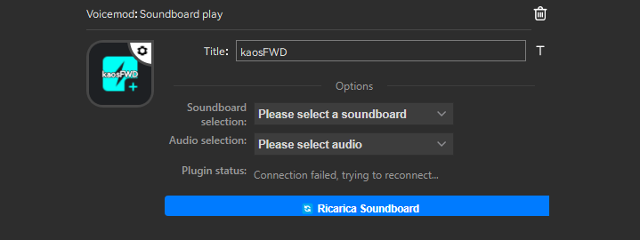
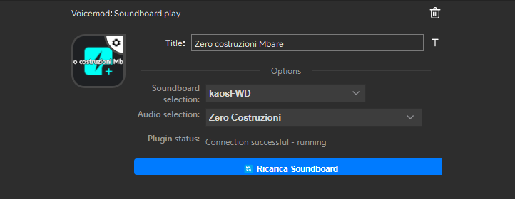

# Voicemod Stream Dock Plugin (Enhanced)

<!-- Language Selector -->
<div align="center">

**🌍 Language / Lingua:** [English](README.md) | [**Italiano**](README_IT.md)

</div>

---

Un plugin migliorato per Stream Dock/Stream Controller che si integra con Voicemod, aggiungendo funzionalità avanzate di caching e gestione delle soundboard.


## ✨ Nuove Funzionalità

### 🔄 Sistema di Cache Persistente
- **Cache automatica**: Le soundboard vengono salvate automaticamente quando Voicemod è online
- **Modalità offline**: Utilizza i dati dalla cache quando Voicemod non è disponibile
- **Persistenza**: La cache rimane valida tra le sessioni fino a quando non viene sovrascritta

### 🎛️ Interfaccia Utente Migliorata
- **Indicatore cache**: Mostra chiaramente quando si stanno utilizzando dati dalla cache
- **Pulsante ricarica**: Aggiorna manualmente le soundboard con un click
- **Pulsante pulisci cache**: Svuota la cache quando necessario
- **Selezione audio persistente**: Ricorda l'audio specifico selezionato anche dopo il riavvio

### 🧠 Logica Intelligente
- **Online**: Usa dati in tempo reale + aggiorna automaticamente la cache
- **Offline**: Utilizza la cache + mostra avviso appropriato
- **Fallback**: Se non c'è cache disponibile, mostra interfaccia pulita



## 📋 Funzionalità Complete

| Azione | Descrizione | Stato |
|--------|-------------|--------|
| **Selezione Voce** | Seleziona il tipo di voce del modificatore vocale | ✅ |
| **Voce Casuale** | Seleziona una voce a caso | ✅ |
| **Modificatore Vocale On/Off** | Attiva/disattiva il modificatore vocale | ✅ |
| **Senti la Tua Voce On/Off** | Attiva/disattiva l'ascolto della propria voce | ✅ |
| **Effetti Ambientali On/Off** | Attiva/disattiva gli effetti sonori ambientali | ✅ |
| **Silenzia On/Off** | Attiva/disattiva la modalità silenziosa | ✅ |
| **Bip Istantaneo** | Riproduce il suono di censura del microfono (funziona solo con vecchie versioni di voicemod) | ✅ |
| **Push-to-Talk Modificatore** | Attiva il modificatore vocale solo quando premuto | ✅ |
| **Riproduci Soundboard** | Riproduce file audio dalle soundboard **(Migliorato)** | ✅ |
| **Ferma Tutti i Suoni** | Interrompe tutti i suoni in riproduzione | ✅ |
| **Silenzia per Me On/Off** | Attiva/disattiva la modalità "silenzia per me" | ✅ |

## 🚀 Installazione

### Metodo 1: Download Release (Consigliato)

1. **Scarica l'ultima versione**
   - Vai alla pagina [Releases](https://github.com/kaosFWD/Stream-Dock-Voicemod-Enhanced/releases)
   - Scarica il file `Stream Dock Voicemod Enhanced v1.0.2 by kaosFWD.zip` dalla release più recente

2. **Estrai il plugin**
   - Estrai il contenuto del file ZIP
   - Dovresti ottenere una cartella chiamata `com.hotspot.streamdock.voicemod.sdPlugin` o simile

3. **Installa in Stream Controller**
   - Apri Esplora File e vai a `%APPDATA%\Stream Controller\Plugins\`
     - Su Windows: Premi `Win + R`, digita `%APPDATA%\Stream Controller\Plugins\` e premi Invio
   - Copia l'intera cartella del plugin estratta in questa directory
   - La struttura finale dovrebbe essere:
     ```
     %APPDATA%\Stream Controller\Plugins\com.hotspot.streamdock.voicemod.sdPlugin\
     ├── action1/
     ├── action2/
     ├── ...
     ├── plugin/
     ├── static/
     └── manifest.json
     ```

4. **Riavvia Stream Controller**
   - Chiudi completamente Stream Controller
   - Riapri Stream Controller
   - Il plugin dovrebbe apparire nella categoria "Voicemod"

### Metodo 2: Clone da Git (Per Sviluppatori)

1. **Clona il repository**
   ```bash
   git clone https://github.com/kaosFWD/Stream-Dock-Voicemod-Enhanced.git
   ```

2. **Installa il plugin**
   - Copia la cartella clonata in `%APPDATA%\Stream Controller\Plugins\`
   - Riavvia Stream Controller

### Post-Installazione

3. **Configura Voicemod**
   - Assicurati che Voicemod sia installato e in esecuzione
   - Configura le tue soundboard in Voicemod
   - Verifica che le soundboard siano abilitate (spunta verde in Voicemod)

4. **Verifica l'installazione**
   - In Stream Controller, dovresti vedere la categoria "Voicemod"
   - Trascina un'azione del plugin sulla tua Stream Dock
   - Se lo stato mostra "Connesso - In esecuzione", l'installazione è riuscita

## 🎮 Utilizzo

### Configurazione Soundboard
1. Aggiungi un'azione "Riproduci Soundboard" al tuo Stream Dock
2. Nelle impostazioni, seleziona la soundboard desiderata
3. Scegli l'audio specifico da riprodurre
4. Le impostazioni vengono salvate automaticamente



### Modalità Offline
Quando Voicemod non è disponibile:
- Il plugin utilizza automaticamente i dati dalla cache
- Appare un indicatore che mostra l'utilizzo della cache
- Le soundboard precedentemente configurate rimangono disponibili

### Gestione Cache
- **Ricarica**: Clicca "🔄 Ricarica Soundboard" per aggiornare manualmente
- **Pulisci**: Clicca "🗑️ Pulisci Cache" per svuotare la cache
- **Automatica**: La cache si aggiorna automaticamente quando Voicemod è online

## 🔧 Requisiti

- **Sistema Operativo**: Windows 7+ o macOS 10.11+
- **Stream Controller**: Versione 2.9 o superiore
- **Voicemod**: Qualsiasi versione recente
- **Hardware**: Stream Dock compatibile (Soomfon o simili)

## 📂 Struttura del Progetto

```
voicemod-stream-dock-plugin/
├── action1-11/          # Cartelle per ogni azione
│   ├── index.html       # Interfaccia Property Inspector
│   └── index.js         # Logica Property Inspector
├── plugin/              # Plugin principale
│   ├── index.html       # HTML del plugin
│   └── index.js         # Logica principale e cache
├── static/              # Risorse statiche
│   ├── css/            # Stili
│   ├── img/            # Icone e immagini
│   └── *.js            # Script condivisi
├── *.json              # File di localizzazione
└── manifest.json       # Manifesto del plugin
```

## 🐛 Risoluzione Problemi

### Plugin non appare in Stream Controller
1. **Verifica la posizione di installazione**:
   - Controlla che la cartella sia in `%APPDATA%\Stream Controller\Plugins\`
   - Verifica che il file `manifest.json` sia nella cartella principale del plugin
2. **Riavvia completamente Stream Controller**
3. **Controlla i log**: Vai su Stream Controller → Settings → Logging
4. **Cosa ho fatto io**: Se non compare ancora, scarica prima il plugin Voicemod dallo store dei plugin di Stream Controller. Poi vai nella cartella %APPDATA%\Stream Controller\Plugins\, estrai lì il contenuto del file ZIP, sovrascrivi i file esistenti e riavvia Stream Controller.

### Le soundboard non appaiono
1. Verifica che Voicemod sia in esecuzione
2. Controlla che le soundboard siano abilitate in Voicemod (spunta verde)
3. Prova il pulsante "🔄 Ricarica Soundboard"
4. Se persiste, prova "🗑️ Pulisci Cache" e ricarica

### Il suono non si riproduce
1. Controlla che Voicemod sia online (indicatore di stato verde)
2. Verifica di aver selezionato sia la soundboard che l'audio specifico
3. Assicurati che il volume di Voicemod non sia azzerato
4. Controlla i log nella console del browser (F12 su Stream Controller)

### Cache non funziona
1. Assicurati di aver configurato le soundboard almeno una volta con Voicemod online
2. Verifica che il plugin abbia i permessi di scrittura sui file di configurazione
3. Prova a pulire e ricreare la cache con il pulsante dedicato

### Errore di connessione
1. **Verifica che Voicemod sia in esecuzione**
2. **Controlla la porta WebSocket**: Voicemod usa la porta `59129`
   - Assicurati che non sia bloccata dal firewall
3. **Riavvia Voicemod** se necessario

## 🔄 Aggiornamenti e Miglioramenti

### Versione Attuale (1.0.2+)
- ✅ Sistema di cache persistente
- ✅ Interfaccia utente migliorata
- ✅ Selezione audio persistente
- ✅ Gestione errori robusta
- ✅ Logging dettagliato per debug

## 🤝 Contribuire

Contributi sono benvenuti! Per contribuire:

1. **Fork** il repository
2. **Crea** un branch per la tua feature (`git checkout -b feature/AmazingFeature`)
3. **Commit** le tue modifiche (`git commit -m 'Add some AmazingFeature'`)
4. **Push** al branch (`git push origin feature/AmazingFeature`)
5. **Apri** una Pull Request

## 📜 Licenza

Questo progetto è distribuito sotto licenza MIT. Vedi `LICENSE` per maggiori informazioni.

## 🙏 Crediti

- **Autore Originale**: HotSpot - Plugin base per Voicemod Stream Dock
- **Miglioramenti e Cache System**: [Il Tuo Nome] - Sistema di cache persistente e interfaccia migliorata
- **Voicemod**: Per l'eccellente software di modifica vocale

---

**⭐ Se questo plugin ti è utile, lascia una stella su GitHub!**